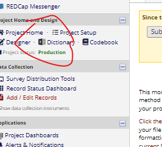
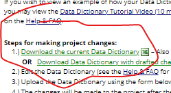

# REDCap: Data Dictionary CSV Export

For users collecting data in a [REDCap](https://www.project-redcap.org) data management system, HEAL-compliant data dictionaries can be generated directly from REDCap exports. 

The REDCap data dictionary export serves the purpose of providing variable-level metadata in a standardized, tabular format and is generally easy to export. The HEAL data utilities leverages this user experience and standardized format to enable HEAL researchers to generate a Heal-compliant data dictionary. 

## Export your Redcap data dictionary 

To download a REDCap CSV export, do the following*: 

1. After logging in to your REDCap project page, locate the `Data dictionary` page. A link to this page may be available on the project side bar (see image below) or in the `Project Setup tab` at the top of your page.



2. After arriving at the `Data dictionary` page, click on `Download the current data dictionary` to export the dictionary (see below).



*there may be slight differences depending on your specific REDCap instance and version

## Run the `vlmd` command

```bash
vlmd extract --inputtype redcap input/example_redcap_demo.redcap.csv 
```